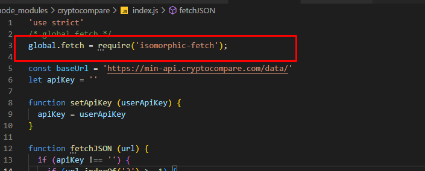

# cryptocompare-test

Before executing this project, we need add one code in index.js of cryptocompare module becase this module has fetch functions.

Main my workings are in /server/routes/crypto.routes.js file.

I added my cryptocompare API_KEY you to test this project easily.

# APIS

<b>'/'</b>:  All registered tokens's latest balances and prices will be displayed as JSON format. In here "registered tokens" means tokens are in /server/constants/data.json data.

<b>'/token/:name'</b>:  Given named token's latest prices and balance will be displayed as JSON format.

<b>'/date/:date'</b>:  Until given date(timestamp), all registered tokens's balances and prices will be displayed as JSON format.

<b>'/token_date/:token/:date'</b>:  Unwil given date, given token's balance and price will be displayed as JSON format.

# Functions
<b>getTokens()</b>: It will set tokens registered in /server/constants/data.json file. Return value is an Array.

<b>getTokenSum(token, date)</b>:  Total amount of given token until give date(timestamp). If the date is not setted, date will be today's value. Return value is a Number.

<b>isTokenExist(token)</b>:  Return whether give token name is existed on registered tokens or not. Return value is a Boolean.

<b>getPriceHistorical(token, date)</b>:  Function that execute cryptocompare api function. It will return given token's price at given date(timestamp). Return value is Object.

<b>getLatestTokenPrice(token)</b>:  Function that execute crytpcompare api function. It will return give token's latest price. Return value is an Object.

<b>getLatestMultiTokenPrice(token_list)</b>:  Function that execute cryptocompare api function. It will return every given tokens's latest prices.

Thank you.
